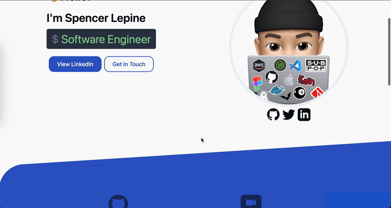

# portfolio 

Personal developer portfolio (http://spencerlepine.com). Static site built with **Next.js** and **TailwindCSS**.



## Built With

- **Node.js**: `>=v18`
- **Next.js**: `v14`
- **TailwindCSS**
- **GitHub Actions** ([documentation](https://docs.github.com/actions))

## Local Development

### Prerequisites

- **Node.js:** Download and install from https://nodejs.org/en (includes npm)

### Run Locally

```sh
$ npm install
$ npm dev
# view on http://localhost:3000
```

### Production Build

```sh
$ npm run clone:nested-blog
$ npm run build:nested-blog
$ npm run build
$ npm run start
# view on http://localhost:3000
```

This command generates static content into the `build` directory and can be served using any static contents hosting service.

## 📁 Previous Versions

- V1: https://github.com/spencerlepine/portfolio-site-v1
- V2: https://github.com/spencerlepine/portfolio-site-v2

## License

[MIT](./LICENSE)
